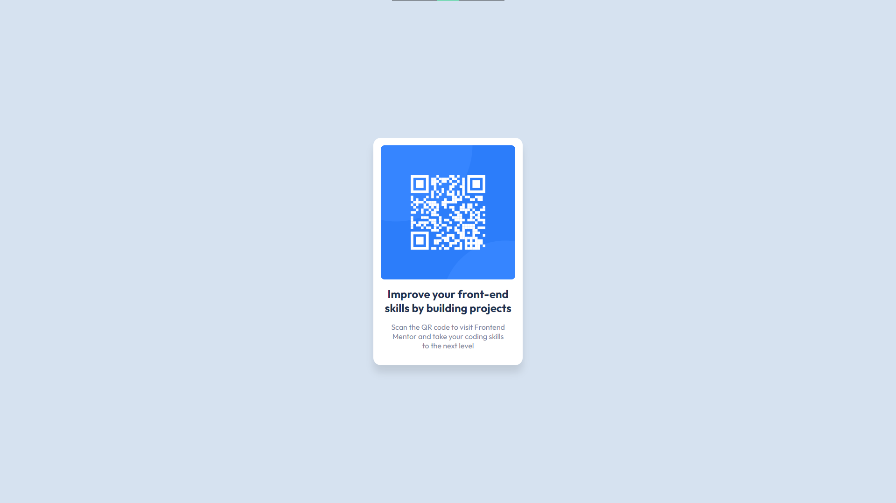

# Frontend Mentor - QR code component solution

This is a solution to the [QR code component challenge on Frontend Mentor](https://www.frontendmentor.io/challenges/qr-code-component-iux_sIO_H). Frontend Mentor challenges help you improve your coding skills by building realistic projects.

## Table of contents

- [Overview](#overview)
  - [Screenshot](#screenshot)
  - [Links](#links)
- [My process](#my-process)
  - [Built with](#built-with)
  - [What I learned](#what-i-learned)
  - [Continued development](#continued-development)
  - [Useful resources](#useful-resources)
- [Author](#author)
- [Acknowledgments](#acknowledgments)

## Overview

### Screenshot



### Links

- Live Site URL: [QR Code Component](https://eparem-qr-code.netlify.app/)

## My process

### Built with

- CSS custom properties
- Flexbox
- Mobile-first workflow
- Vanilla

### What I learned

I've learned to use to use Flexbox and how to center elements by using `justify-content` and `align-items`

```css
.container {
  display: flex;
  align-items: center;
  justify-content: center;
  flex-direction: column;
  [...]
}
```

### Continued development

I still want to learn more about how Flexbox, and eventually Grid layouts, the next major step would be to remember some syntaxes!
It's just the beginning and I can't wait to make more!

### Useful resources

- [Firefox MDN Web Docs](https://developer.mozilla.org/en-US/docs/Web/CSS) - This helped me quite a lot with CSS and HTML in general whenever I needed to document myself.
- [Kevin Powell](https://www.youtube.com/watch?v=u044iM9xsWU) - An amazing person that motivated me to start working with HTML and CSS.

## Author

- Frontend Mentor - [@RemEpau](https://www.frontendmentor.io/profile/RemEpau)

## Acknowledgments

Big thanks to [Kevin Powell](https://www.kevinpowell.co/) for making me start falling in love with web developpement!
